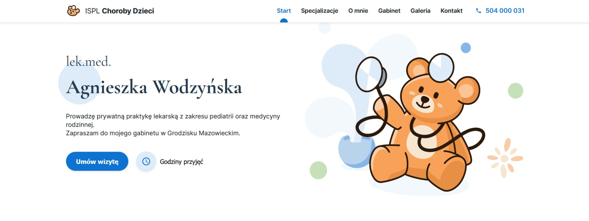
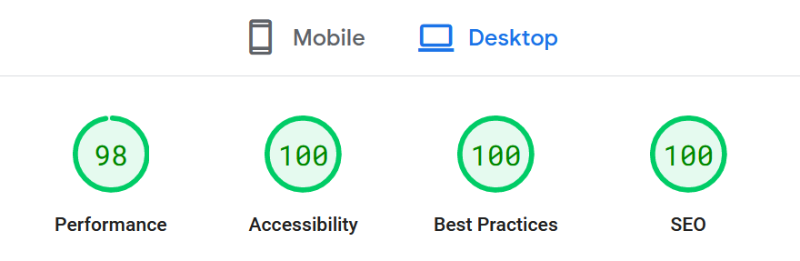

# ISPL Choroby Dzieci - Pediatrician Onepager

Responsive personal website for pediatrician doctor.
[See the website live.](https://lekarz-grodzisk.pl/)

## Table of Contents

- [General info](#general-info)
- [Setup](#setup)
- [Design](#design)
- [Features](#features)
- [Technologies](#technologies)
- [Performance](#performance)
- [Challenges](#challenges)
- [Possible Improvements](#possible-improvements)
- [Acknowledgements](#acknowledgements)
- [Contact](#contact)

## General Info

Simple onepager website for pediatrician's private practice. The website presents content in an attractive way with a smooth user experience. This project was created in order to practice performance optimization, RWD solutions and build typical website elements from scratch. The project has been developed in cooperation with a commercial customer.

## Setup

The project uses [node](https://nodejs.org/en/) and [npm](https://www.npmjs.com/) for managing live-server. To run the app on your machine you should install all dependencies. Then create a localhost port and run your web explorer.

Clone repository

```
$ git clone https://github.com/M-Mikos/ispl-choroby-dzieci.git
```

Install dependencies

```
$ npm i
```

Go live with live-server

```
$ npx live-server
```

Pediatrician Onepager is ready at port 8080.

```
http://localhost:8080/
```

## Design

The website is based on detailed data provided by the customer. The end users of the website are parents other people seeking general medical help. As a result, the starting point for creating process was the vision of a clear project with a friendly, trustworthy style.

### Design building

The priority was a clear presentation of the content, adapted to the requirements of accessibility. The desired user behavior is to obtain valuable information and contact the website owner.

An important case was to adapt the layout to different screen sizes, in particular mobile devices. A mobile-first approach was used.

A static mock-up has been prepared for the presentation. Mock-up was created with the [Figma](https://figma.com) software.

### Graphic elements

The logo, teddybear graphic on the start screen and other graphic elements are self-prepared. Exceptions: some interface icons and background image in the offer section. Photos were provided by the customer.

## Features

- optional top bar info, controlled by `config.js` file for easy content changing,
- currently displayed section indicator (only in desktop version),
- dropdown menu on mobile devices,
- smooth scrolling to sections,
- sticky header,
- modal prepared for multiple use,
- media lazy loading,
- responsive layout based on custom breakpoints,
- keyboard navigation,
- lightbox gallery generated from tagged images, with gestures controlling on a mobile device.
- integration with Google Analytics 4 and Google Tag Manager
- self-made cookie consent solution (based on GPDR requirements, details below)

## Technologies

The assumption was to use plain JS and CSS without frameworks and as little external libraries as possible.

Used technologies:

- HTML5
- CSS3
- JavaScript (ECMAScript 2020)
- [JSON](https://www.json.org/json-en.html)
- [Lodash 4.17.15](https://lodash.com/)
- [Google Tag Manager](https://tagmanager.google.com)

The JavaScript code has divided into modules that are reusable across different projects, handled by the main `controller.js` file. The BEM methodology was used to structure CSS styles.

More information about modules is included in the documentation inside the module files.

## Performance




_Results may be diffrent on your device._

The goal was to achieve highest possible [Google Page Speed](https://pagespeed.web.dev/) on mobile and desktop devices. Selected solutions:

- proper configuration of .htaccess file (defining browser cashe)
- optimizing image types, sizes and loading
- defering non-critical CSS and JS code (for example third party code from Google Map iframe)
- font files are self hosted

The minor performance reduction is likely caused by the size of the gtag library script.

### Media optimization

The website uses custom lazy loading solution. Images are compressed by [squoosh.app](https://squosh.app) tool.

### Accessibility

The site has been tested using the [WAVE Web Accessibility Evaluation Tools](https://wave.webaim.org/) to achieve a high standard of accessibility.

## Challenges

### Indicating currently displayed section

An interesting case was making a dynamic indicator of the current menu item. The first idea was to use the Intersection Observer API. The Intersection Observer was able to specify the visible percentage of the section, but when several sections were visible at once, it was not suitable for specifying the one that takes up most of the viewport.

Checking the currently displayed section takes place at each scroll event. In order to reduce frequency of calls, the `throttle()` function from the Lodash library was used.

Piece of the logic responsible for determining the section that takes up most of the screen area (sections lower than 50% of the screen height are out of the scope):

```javascript
const [newCurrentSection] = sections.filter((element) => {
  const elementRect = element.getBoundingcustomerRect();

  // Get position of element top and bottom border relative to document top
  const elementTop = elementRect.top + viewportTop;
  const elementBottom = elementRect.bottom + viewportTop;

  // Return when element is entirely out of viewport
  if (viewportBottom < elementTop || viewportTop > elementBottom) return false;

  // Calculate visible element height
  const visibleTop = elementTop > viewportTop ? elementTop : viewportTop;
  const visibleBottom =
    elementBottom > viewportBottom ? viewportBottom : elementBottom;
  const visibleHeight = visibleBottom - visibleTop;

  if (visibleHeight / viewportHeight > 0.5) return true;
  return false;
});
```

### Lightbox gallery

A completely new issue was the addition of gesture control on mobile devices. This was achieved by examining the touching events `touchstart`, `touchmove` and `touchend`

```javascript
// Swiping navigation

let initialX = 0;
let slideDirection;

const slider = document.querySelector(".lightbox__slides");

const beginSwipe = (e) => {
  initialX = e.touches[0].customerX;
};

const swipe = (e) => {
  const swipeLength = initialX - e.touches[0].customerX;

  slider.style.transform = `translateX(${sliderShift - swipeLength}px)`;

  if (swipeLength < -40) slideDirection = "left";
  else if (swipeLength > 40) slideDirection = "right";
  else slideDirection = null;
};

const stopSwipe = (e) => {
  e.preventDefault();
  if (slideDirection === null) showCurrentSlide();
  if (slideDirection === "left") prevSlide();
  if (slideDirection === "right") nextSlide();
};

slider.addEventListener("touchstart", beginSwipe, { passive: true });
slider.addEventListener("touchmove", swipe, { passive: true });
slider.addEventListener("touchend", stopSwipe);
```

### Cookie consent banner

While creating the website, I implemented my own cookie consent management solution. The solution contains:

- integration with Google Tag Manager in order to effectively block non-essential cookies via the dataLayer object
- loading cookie details from a separate `cookieData.json` file
- dynamic generation of consent banner content based on the loaded data
- possibility of giving consent to individual groups of cookies
- possibility of easily accepting or rejecting cookies
- storing information about consent in the functional cookie file on the user's browser
- blocking the use of the website without deciding on cookies

_Disclaimer_
_The cookie consent solution and its content was created on the basis of data provided by the owner of the website. I do not take responsibility for the compliance of the solution with the current legal status._

---

### What have I learned

- Working on the project gave me more complex knowlede about responsive design principles, especially handling the @media rule in mobile-first approach, css-grid and responsive image sizing.
- I had the opportunity to build popular UI solutions from scratch, such as mobile dropdown menu, lightbox gallery or modal.
- For the first time I used gesture events to handle ligtbox gallery slider navigation.
- I got deeper insight in performance and SEO optimization, as well as implementig Google Tag Manager and Google Analytics 4

## Possible Improvements

- expanding the lightbox gallery functionality (zooming images, sharing, download button),
- support for e-mail contact using the form,
- further code optimization, replacing plain CSS with SaSS preprocessor,
- refactoring JS modules for easier reuse.

## Acknowledgements

Useful resources

- _The Complete JavaScript Course 2023: From Zero to Expert!_ - by Jonas Schmedtmann
- _Build Responsive Real-World Websites with HTML and CSS_ - by Jonas Schmedtmann

Tools:

- image optimization: https://squosh.app
- generating icon pack: https://icomoon.io
- generating font pack for self hosting: https://transfonter.org
- generating website icons: https://realfavicongenerator.net/
- generating vendor prefixes: https://autoprefixer.github.io/
- minifying css: https://www.minifier.org/
- extracting critical css: https://jonassebastianohlsson.com/criticalpathcssgenerator/
- checklist: https://frontendchecklist.io

Graphic assets:

- Fonts - fonts.google.com
- Interface icons - fonts.google.com/icons
- Offer section background image - https://unsplash.com/photos/p33-JPlv55g, author: Bermix Studio

## Contact

Design & code by [Marcin Mikos](mailto:mikos.marcin.m@gmail.com) - feel free to contact me!
